# gkBlog 软件结构图

本文档包含 gkBlog 现代化博客网站主题软件的各种结构图、逻辑图和流程图。

## 1. 系统架构图

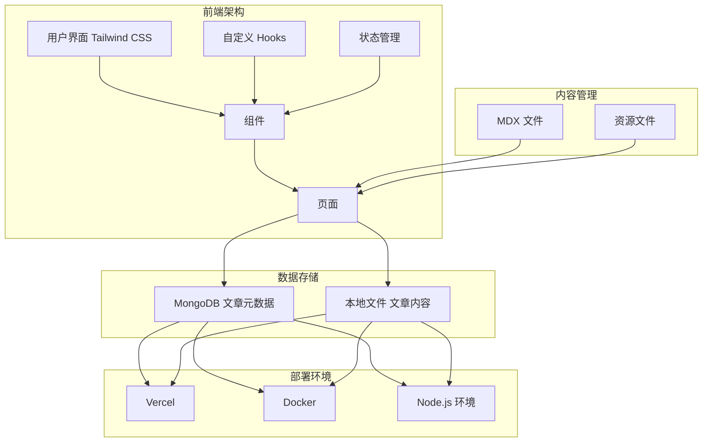

## 2. 项目结构图

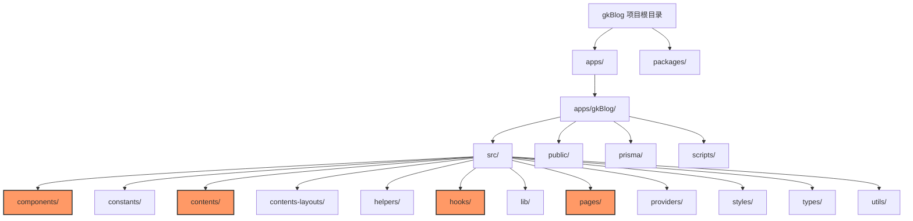

## 3. 模块划分图

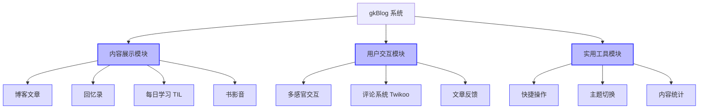

## 4. 数据库模型图

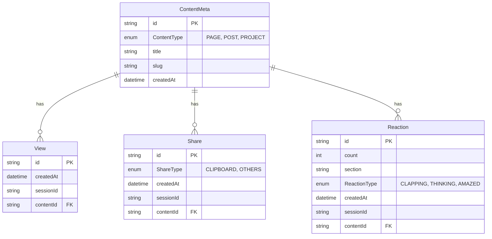

## 5. 页面导航流程图

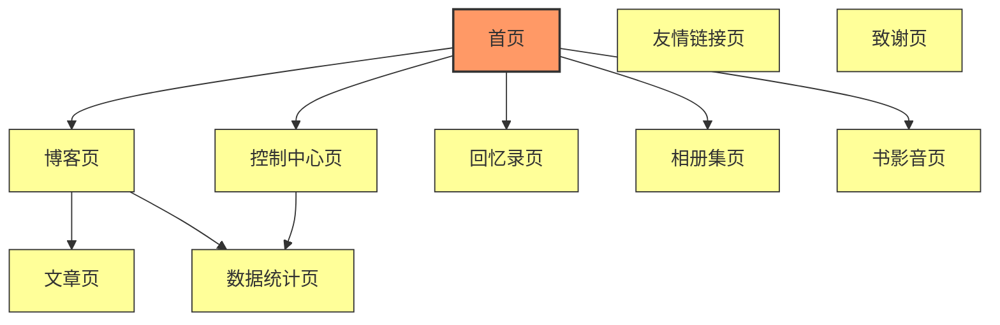

## 6. 博客文章管理流程图

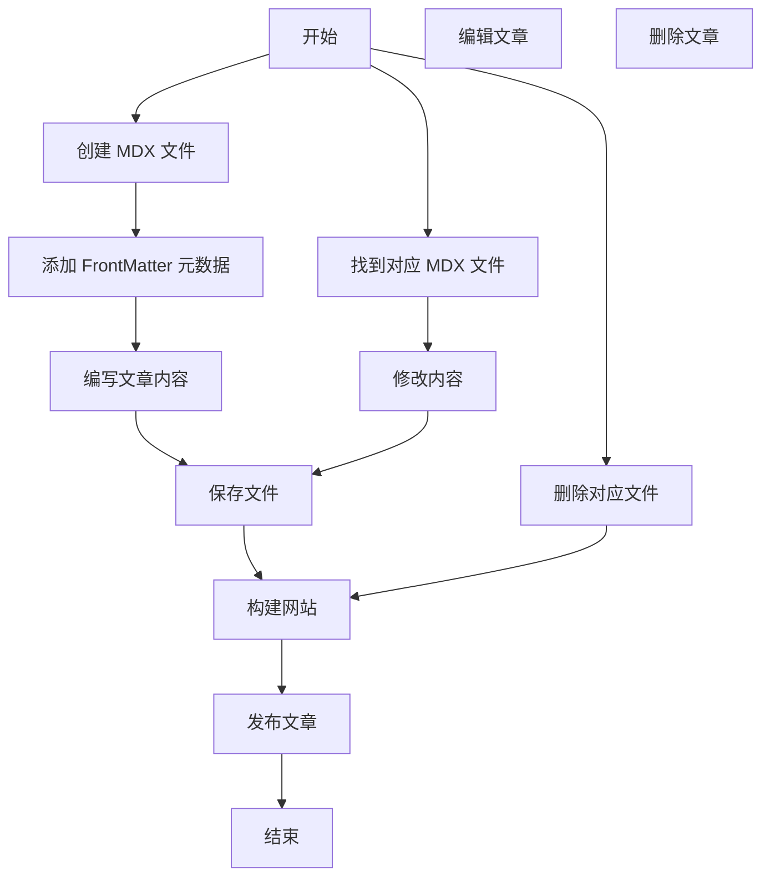

## 7. 评论系统流程图

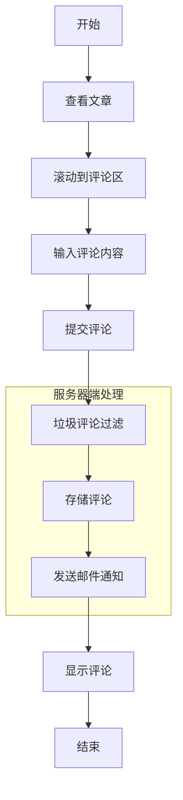

## 8. 数据统计流程图

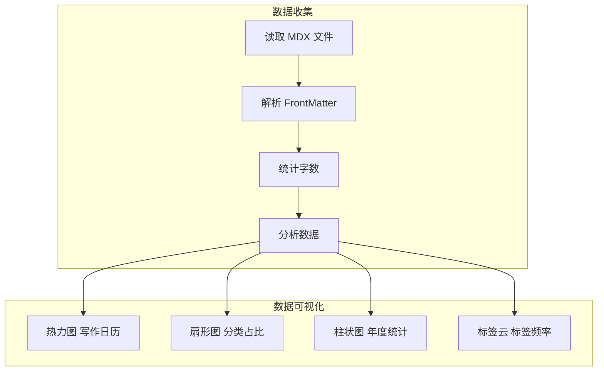

## 9. 书影音标记流程图

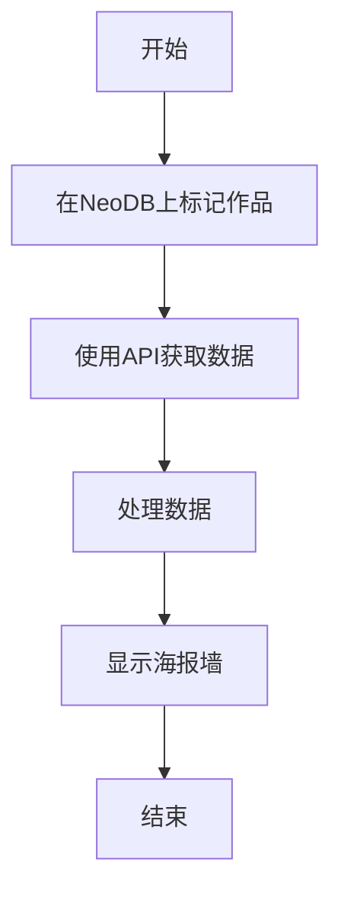

## 10. 主题切换逻辑图

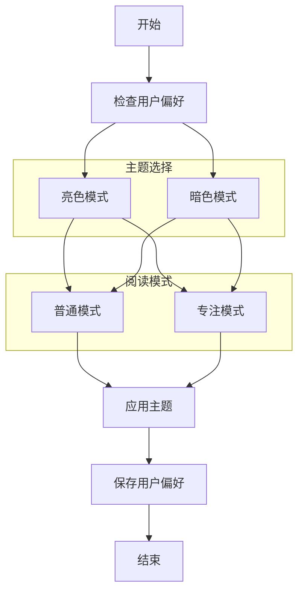

## 11. 部署流程图

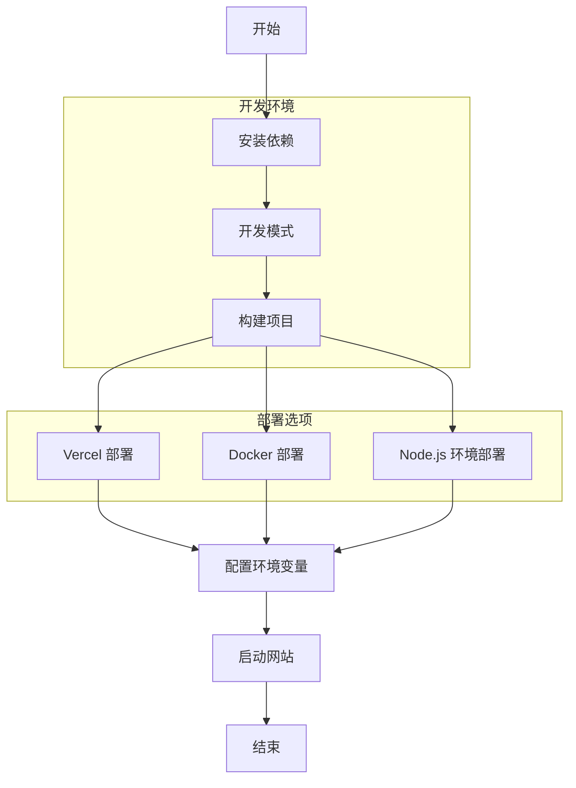

## 12. API接口流程图

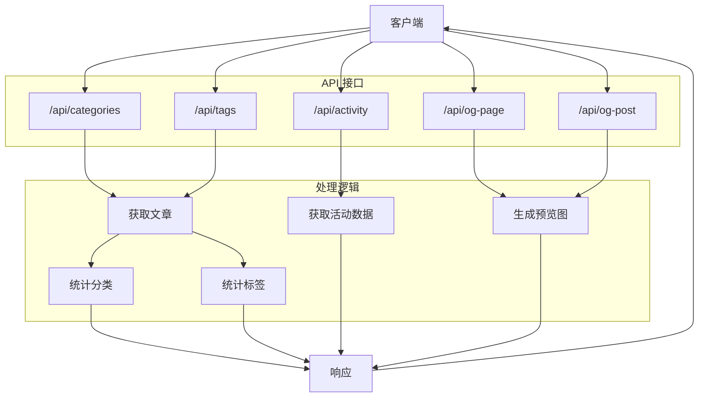

## 13. 组件交互图

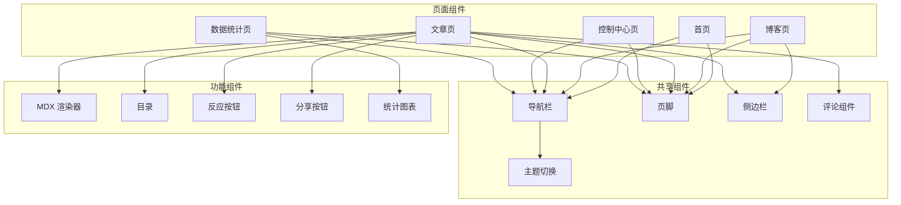

## 14. 用户交互流程图

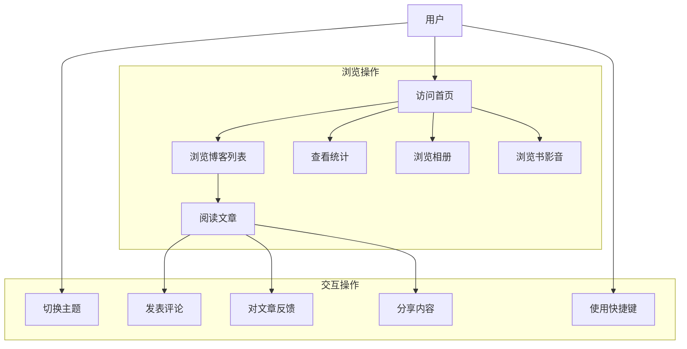

## 15. 数据流图

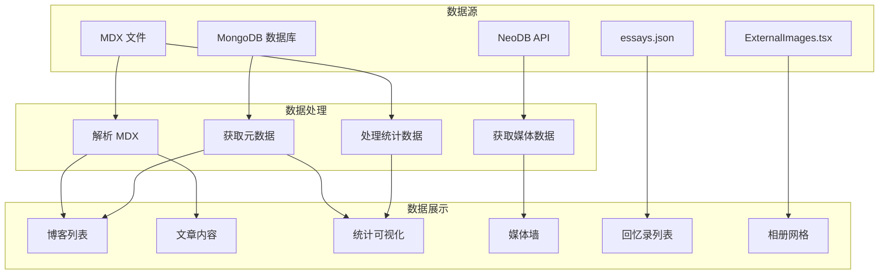

## 16. 前端组件层次结构图

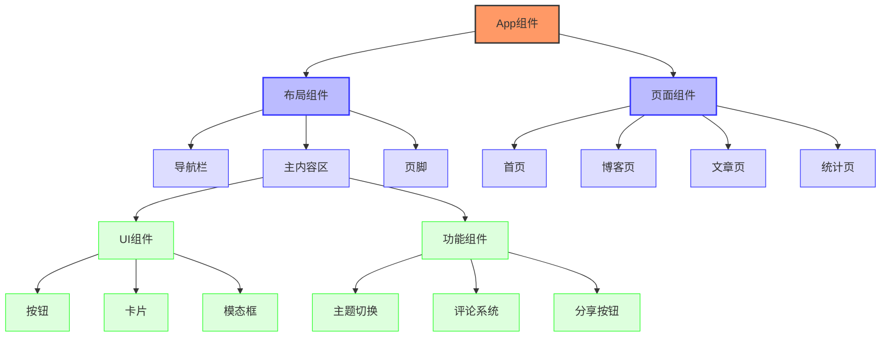

## 17. MDX内容处理流程图

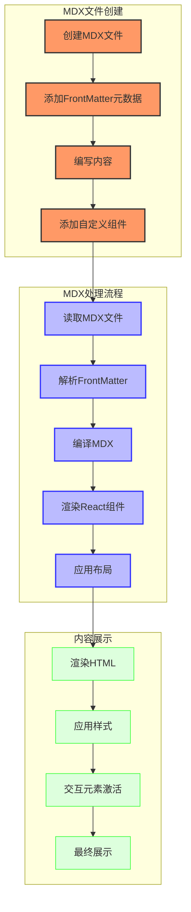

## 18. 用户数据库交互流程图

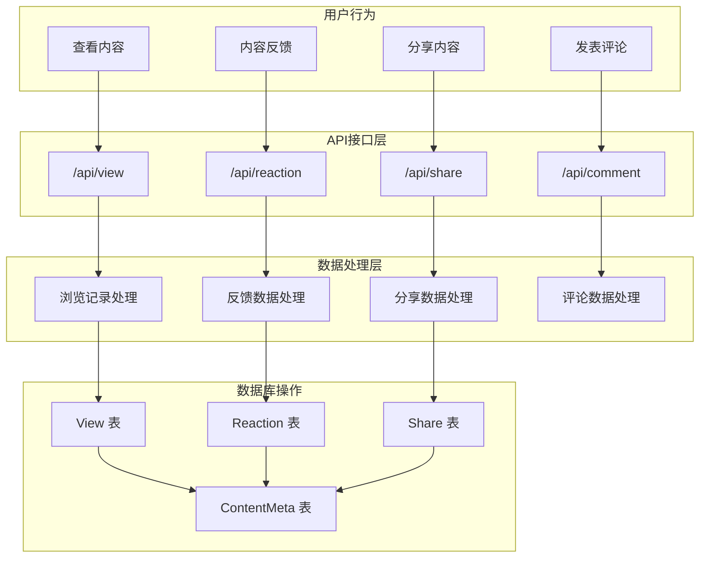
