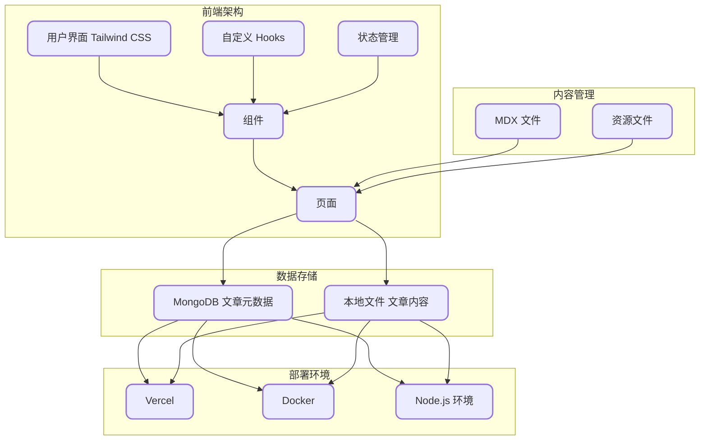

<h2 align="center">
🚀 @qlAD 乔 &middot; gkBlog 现代化博客网站主题软件
</h2>

<p align="center">
🌐 使用 Turborepo 和 pnpm 构建的博客网站，基于 <a href="https://www.enji.dev/">enji.dev</a> 主题二次开发
</p>

<p align="center">
  
</p>

<div align="center">

✨在线预览：<https://www.qladgk.com> ✨

</div>

<div align="center">
  
  
  
  
  
  
  
</div>

---

## 🛠️ 系统架构

gkBlog 系统采用现代化的全栈技术架构，具体如下：

- **前端**：使用 Next.js、React 和 TypeScript 构建用户界面，确保应用的高性能和开发效率。
- **样式**：采用 Tailwind CSS 框架，实现灵活且响应式的样式管理。
- **内容**：支持 MDX 格式，便于内容创作和富文本编辑。
- **数据库**：使用在线版 MongoDB 存储文章元数据，而文章内容则存储在本地项目目录中。
- **部署**：支持通过 Vercel 或 Node.js 环境进行部署，也可以生成 Docker 镜像。

系统架构图如下所示：



> 📝 有关更多流程图见： [项目流程图](FlowChart.md)

---

## 💻 项目开发

首先，我建议[安装 pnpm](https://pnpm.io/installation)，因为它是此项目中使用的包管理器。

1. **Fork 本项目**，然后将其克隆到本地机器：

   ```bash
   git clone <your-fork>
   cd ./gkBlog
   ```

2. **准备好对 `env.local` 文件进行配置**：

   ```bash
   cp ./apps/gkBlog/env.example ./apps/gkBlog/env.local
   ```

   ```yaml
   DATABASE_URL = your-database-connection-string
   SALT_IP_ADDRESS = super-secret
   NEXT_PUBLIC_BAIDU_TONGJI = xxxxxxxxxxxxxx
   NEXT_PUBLIC_GOOGLE_ID = xxxxxxxxxxxxxx
   ```

   > 📝 对于 `DATABASE_URL`，请使用您的数据库连接字符串。我个人使用的是免费版的 [MongoDB](https://www.mongodb.com/)，你也可以在免费版中创建数据库，并在 `env.local` 中添加连接字符串。它看起来应该如下所示：
   >
   > ```
   > mongodb+srv://<username>:<password>@<cluster-url>/<database>?retryWrites=true&w=majority&appName=<app-name>
   > ```
   >
   > 🗝️ 至于 `SALT_IP_ADDRESS`，你可以随意填写一些你的密码。它的作用是用于加密数据库处理。

3. **配置完成后**，仍然在项目根目录下安装所需的依赖项：

   ```bash
   pnpm install
   ```

4. **最后，运行项目**：

   ```bash
   pnpm dev
   ```

现在，你的项目应该已经启动并顺利运行了！🎉

---

## 🚀 部署运行

- **支持 Vercel 一键部署（海外用户推荐）**

  [](https://vercel.com/new/clone?utm_source=busiyi&utm_campaign=oss&repository-url=https%3A%2F%2Fgithub.com%2FqlAD%2FgkBlog&env=DATABASE_URL%2CSALT_IP_ADDRESS%2CNEXT_PUBLIC_BAIDU_TONGJI%2CNEXT_PUBLIC_GOOGLE_ID)

- **使用 Docker 部署（国内服务器推荐）**

  ```bash
  docker compose build
  docker compose up -d
  ```

- **支持 Node.js 环境部署**

  ```bash
  pnpm install
  pnpm build
  pnpm start
  ```

---

## 📝 备忘录

### 🔄 网站更新

- **Vercel**：随着 GitHub 仓库的更新自动部署。
- **国内服务器**：采用 Docker 蓝绿部署，具体命令如下：
  假设当前运行的是 **Green:3000**，此时需要更新 **Blue:3001**

  ```bash
  docker compose -f docker-compose-blue.yml pull # 给 blue 容器拉取最新镜像
  docker compose -f docker-compose-blue.yml up -d # 运行 blue 容器
  ```

  然后检查 `ip:30001` 后无问题切换流量到 `3001`

  ```bash
  docker compose -f docker-compose-green.yml pause # 先停止 green 容器
  ```

  过一段时间后发现 Blue 无问题就可停止或删除 Green，反之恢复 Green 后切换流量。

### 📂 主仓库

- GitHub：[https://github.com/qlAD/gkBlog](https://github.com/qlAD/gkBlog)

#### 📑 备份仓库

- 自建 Git 服务器：[https://git.qladgk.com/qlAD/gkBlog](https://git.qladgk.com/qlad/gkBlog)
- 国内码云：[https://gitee.com/qlAD/gkBlog](https://gitee.com/qlad/gkBlog)

### 🌐 运行架构

- **国内**：阿里云 Docker 容器、ESA [https://www.qladgk.com](https://www.qladgk.com)
- **国外**：Vercel [https://gkblog.vercel.app](https://gkblog.vercel.app)

---

## 🔑 密钥和变量

| 变量名称                 | 描述                     | 获取地址                                                                                                                   |
| ------------------------ | ------------------------ | -------------------------------------------------------------------------------------------------------------------------- |
| BAIDU_API_URL            | 百度资源搜索 API 链接    | [https://ziyuan.baidu.com/](https://ziyuan.baidu.com/)                                                                     |
| BING_API_KEY             | 必应 IndexNow 密钥       | [https://www.bing.com/indexnow/getstarted/](https://www.bing.com/indexnow/getstarted/)                                     |
| NEXT_PUBLIC_BAIDU_TONGJI | 百度统计代码             | [https://tongji.baidu.com/](https://tongji.baidu.com/)                                                                     |
| NEXT_PUBLIC_GOOGLE_ID    | 谷歌分析代码             | [https://analytics.google.com/analytics/web/](https://analytics.google.com/analytics/web/)                                 |
| ALIYUN_REGISTRY          | 阿里云容器镜像仓库地址   | [https://cr.console.aliyun.com/cn-hangzhou/instances/mirrors](https://cr.console.aliyun.com/cn-hangzhou/instances/mirrors) |
| DOCKER_USERNAME          | 阿里云容器镜像仓库用户名 | [https://cr.console.aliyun.com/cn-hangzhou/instances/mirrors](https://cr.console.aliyun.com/cn-hangzhou/instances/mirrors) |
| DOCKER_PASSWORD          | 阿里云容器镜像仓库密码   | [https://cr.console.aliyun.com/cn-hangzhou/instances/mirrors](https://cr.console.aliyun.com/cn-hangzhou/instances/mirrors) |
| NEODB_ACCESS_TOKEN       | NeoDB 访问令牌           | [https://neodb.social/developer/](https://neodb.social/developer/)                                                         |
| SALT_IP_ADDRESS          | 数据库盐值               | 随意填写一些你的密码                                                                                                       |
| NEXT_PUBLIC_TWIKOO_ENVID | Twikoo 评论系统环境 ID   | [https://twikoo.js.org/](https://twikoo.js.org/)                                                                           |

### ✏️ 内容创作

#### 文章 FrontMatter

```yaml
---
title: Next.js 静态博客搭建指南 - 从架构设计到部署上线
description: "详细解析如何使用 Next.js 搭建静态博客，包括技术选型对比(Hexo/Hugo/WordPress)、MDX 内容管理、Twikoo 评论系统集成和 Serverless 部署方案。"
date: "2024-10-18"
lang: zh
tags:
  - nextjs
  - 环境配置
category: 技术
cover: images/20250422153424876.png
---
```

#### 🖼️ 图床工具

- 阿里云 OSS 自建图床，使用 PicGo 客户端上传图片。
- 或者使用阿里云官方提供工具 OSS-Browser [https://help.aliyun.com/zh/oss/developer-reference/use-ossbrowser](https://help.aliyun.com/zh/oss/developer-reference/use-ossbrowser)

#### 🎨 图片生成工具

- **Mermaid 流程图**：使用在线 Mermaid 生成工具：[https://mermaid.live/edit](https://mermaid.live/edit)
- **封面/缩略图**：在线图片生成器：[https://picprose.pixpark.net/zh](https://picprose.pixpark.net/zh) ，设计布局如下：

  

- **手绘风格图**：使用在线 excalidraw 绘图工具：[https://excalidraw.com/](https://excalidraw.com/)

#### 📸 图片处理

- 图片压缩工具：图小小 [https://picsmaller.com/](https://picsmaller.com/)

---

## 🤝 贡献

对于那些想要贡献代码的人，请参阅 [贡献指南](CONTRIBUTING.md)。

**贡献者名单**

<a href="https://github.com/qlAD/gkBlog/graphs/contributors">
  
</a>

---

## 🌟 Star 历史

[](https://www.star-history.com/#qlAD/gkBlog&Date)

---

## 📜 License

本仓库遵循 [MIT License](LICENSE) 开源协议，请在使用前仔细阅读，欢迎您的使用和贡献。
